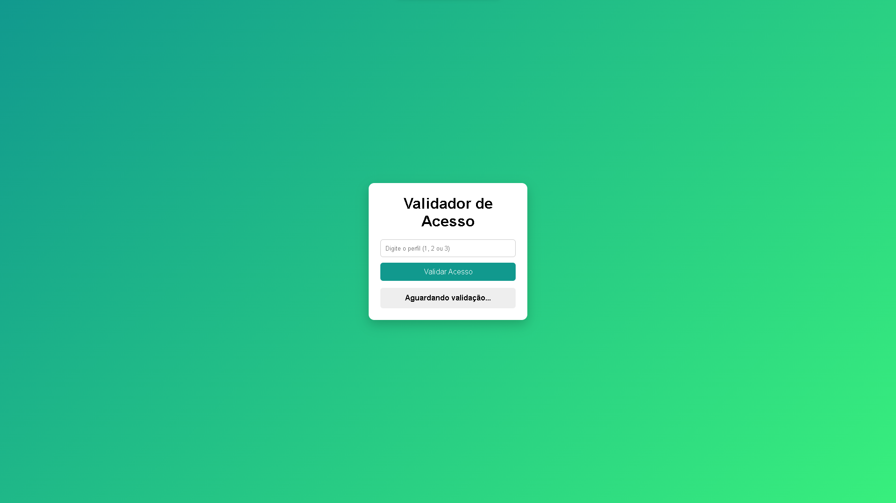
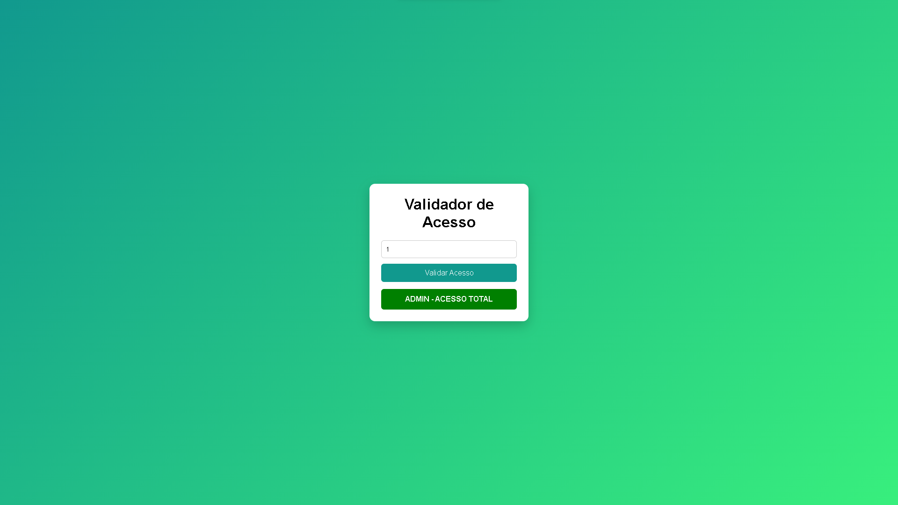
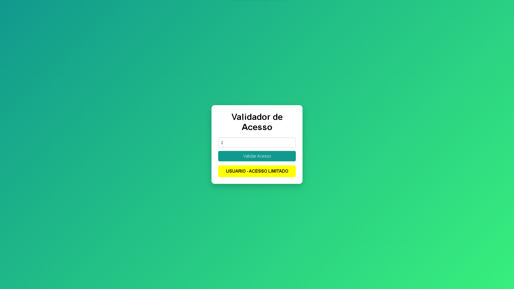
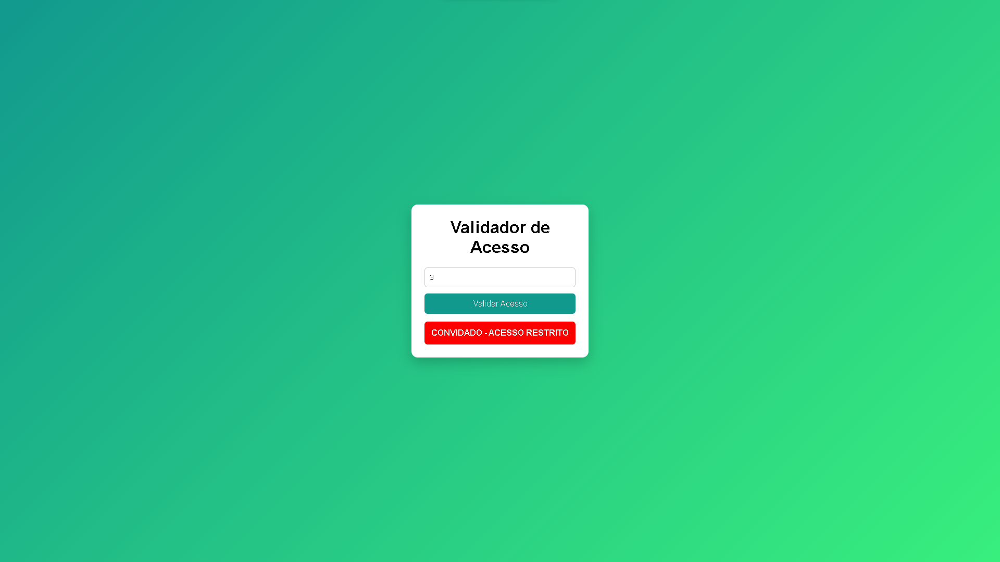

# 🔐 Validador de Acesso por Perfil

Projeto desenvolvido em **JavaScript** com foco em lógica de programação, fluxo de decisão e manipulação do DOM, utilizando a estrutura `switch case` para validar diferentes perfis de acesso.

---

## 📌 Sobre o projeto

O sistema permite que o usuário informe um **perfil numérico** e, com base nesse valor, determina o nível de acesso concedido.

Cada perfil possui um comportamento específico, com **mensagens claras e feedback visual**, simulando um cenário real de controle de acesso.

---

## ⚙️ Funcionalidades

- Entrada de perfil do usuário
- Validação por tipo de perfil
- Uso de `switch case` para controle de fluxo
- Manipulação do DOM
- Feedback visual dinâmico (cores e mensagens)
- Tratamento de valores inválidos

---

## 🧠 Regras de acesso

| Valor | Perfil     | Acesso |
|------|-----------|--------|
| 1    | Admin     | Acesso total |
| 2    | Usuário   | Acesso limitado |
| 3    | Convidado | Acesso restrito |
| Outro | —        | Acesso negado |

---

## 🛠️ Tecnologias utilizadas

- **HTML5**
- **CSS3**
- **JavaScript**
  - DOM
  - Eventos
  - Switch Case

---

## 📷 Screenshots

> Abaixo estão alguns exemplos dos estados da aplicação:

### 🔹 Tela inicial


### 🔹 Perfil Admin


### 🔹 Perfil Usuário


### 🔹 Perfil Convidado


### 🔹 Perfil inválido


---

## 🚀 Como executar o projeto

1. Clone este repositório:
   ```bash
   git clone https://github.com/borgesfariasj2-create/validador-de-perfil-basico-js.git
